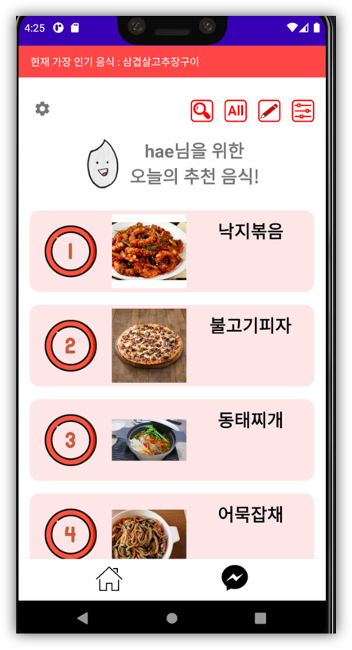
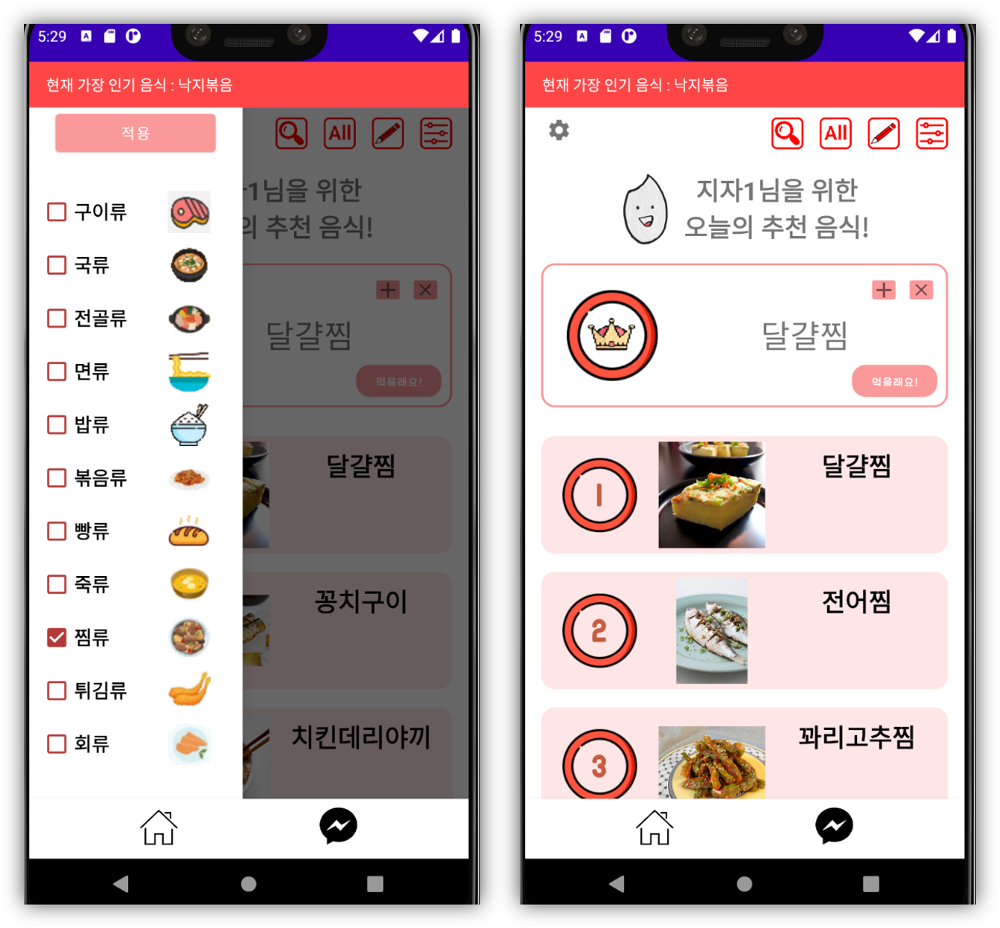
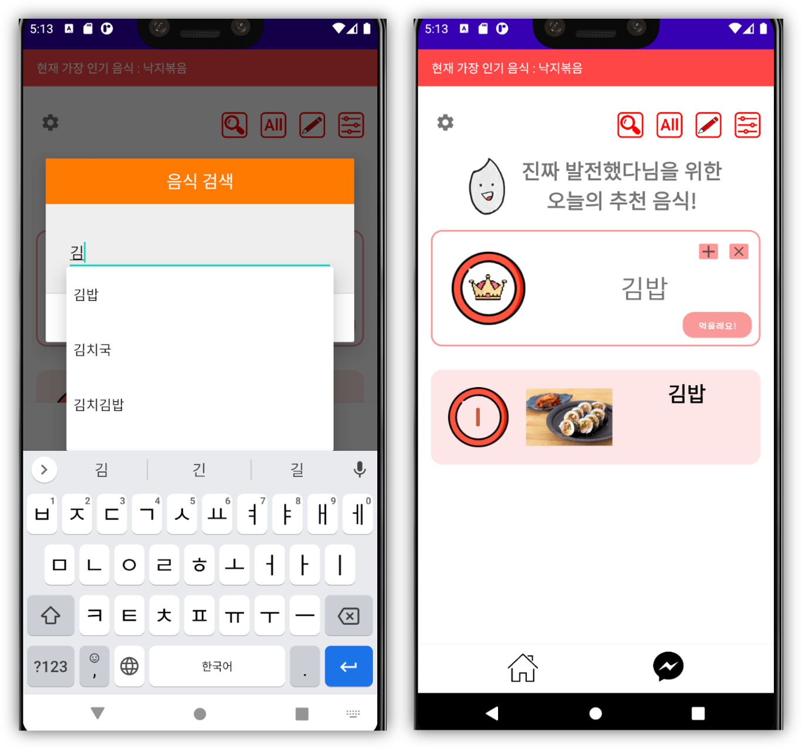
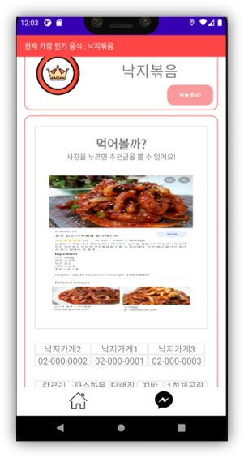
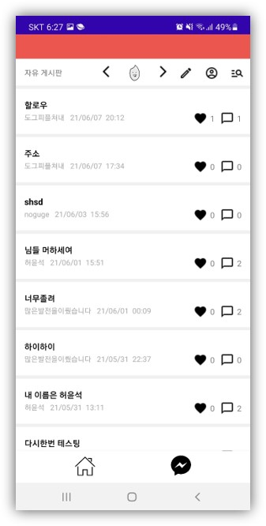
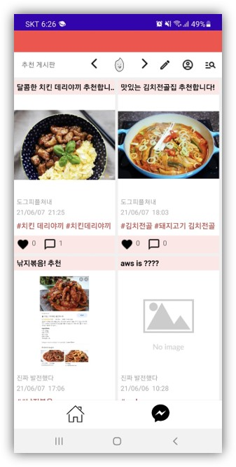
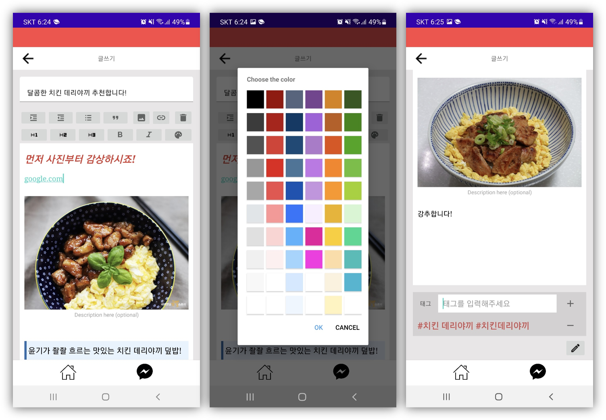
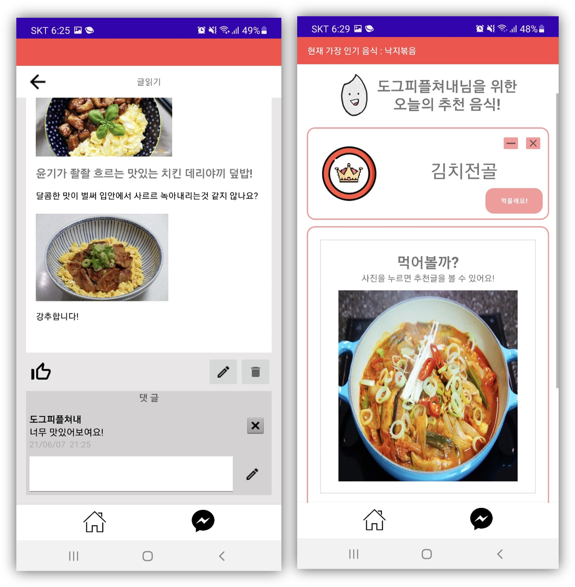
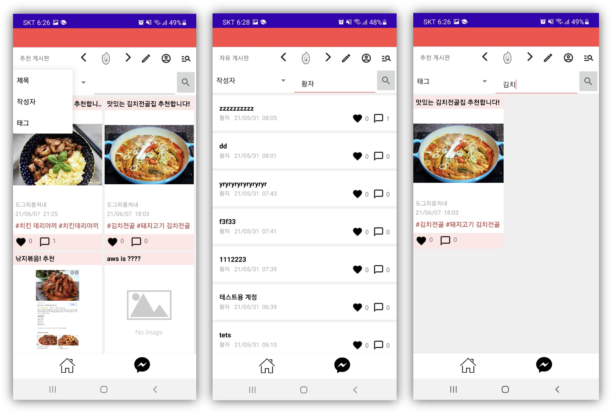

# 밥 골라줘

많은 음식 선택지 속에서 식사 메뉴를 쉽게 결정하지 못하는 사람들을 위한 애플리케이션입니다.  
사용자의 과거 식사 기록들을 학습하여, 이전 식사시간에 먹은 음식을 기반으로 식사 메뉴를 추천합니다.

* **AWS Lambda** 서비스를 이용하여 서버리스 애플리케이션을 구현합니다.
* **AWS Personalize** 서비스를 이용하여 사용자의 식습관을 학습하고, 다음에 먹을 음식을 예측하여 추천합니다.
* **AWS Cognito**, **MongoDB** 서비스를 이용하여 로그인 기능을 지원합니다.
* **AWS S3**, **MongoDB** 서비스를 이용하여 자유게시판과 추천게시판, 음식점 정보 저장을 지원합니다.

## 개발 환경
> Android Studio (Java)

## 핵심 기능
> **Recommendation**  
  Google Forms를 통해 수집한 식사 기록 데이터를 가공하여 AWS Personalize로 학습하고, 이전에 먹은 음식을 기반으로 음식 추천

  

> **Filtering**  
  음식 대분류를 기준으로 필터링, 음식 이름으로 음식 검색

  
  

> **Food description**  
  선택한 음식에 대한 **게시판 글을 검색** 및 **음식점 추천**(광고)
  

  

> **Board**  
  자유롭게 글을 쓰는 **자유게시판**과 음식을 추천하는 **추천게시판**
  AWS S3에 사진을 저장하고, MongoDB에 글과 관련된 정보들을 저장  
  오픈소스 WYSIWYG Editor를 이용하여 글쓰기 기능 구현

  
  

  

> **Comment**, **Recommend with Board**  
  댓글과 좋아요 기능  
  추천게시판에 작성된 글의 **태그**를 이용하여 음식 상세설명페이지에서 관련된 글을 연결

  

> **Board search**  
  게시판의 글 찾기(글 제목, 작성자 닉네임, 태그) 기능

  

## 한계점
* 비동기 처리를 구현하지 않았다.
    * AWS 서비스와 통신하는 시간 동안 'Thread.sleep()'을 이용하여 강제로 앱이 대기하도록 만들었다.
    * **해결법**: 프로젝트 마무리 후 **AsynTask**로 해결할 수 있다는 것을 알았다.
* 빠른 문제 해결을 위해 전역 변수를 남발하였다.
    * 비동기 처리를 편법으로 해결하기 위해 사용
    * 클래스간에 공유가 필요한 변수를 단순히 전역 변수로 해결
    * **해결법**: Android Studio의 경우 Sharedpreferences 사용, 자바스크립트의 경우 모듈 패턴 사용
      * 디자인 패턴에 대해서 공부해야 함
* Personalize가 유저별 추천이 불가능했다.
    * 서비스를 제대로 이해하지 못하고 사용했다.

## 개발 인원
* Front end: 2명 (추천페이지 기능 담당, 추천페이지 디자인 및 게시판 담당)
* Back end: 2명 (데이터 전처리 및 Personalize 학습 담당, Cognito/S3/MongoDB와 Lambda 구현 및 Amplify API 구현)
